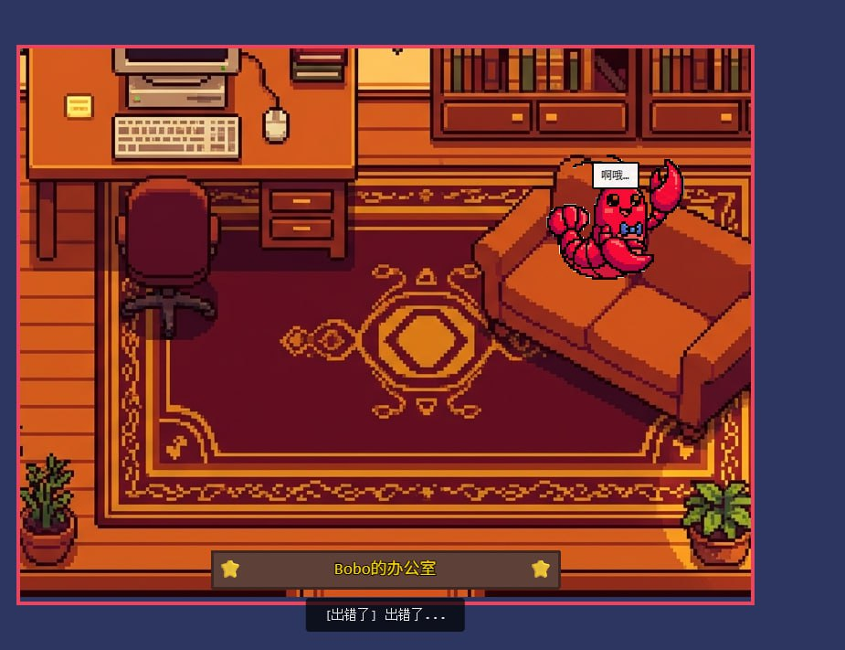

# 🏢 Bobo的办公室 - 实时 AI 状态可视化系统

一个结合 **Telegram WebApp** 的实时 AI 助手状态可视化项目，将 AI 的工作状态以像素游戏的形式呈现在手机和浏览器中。

> 基于 [ringhyacinth/Star-Office-UI](https://github.com/ringhyacinth/Star-Office-UI) 深度定制

## 📱 效果展示

### Telegram 中的实时办公室



**特点：**
- 🏢 完整的像素办公室场景（AI 生成）
- 🦞 可爱的龙虾角色（282px，醒目可见）
- 💬 实时状态显示（中文）
- ⭐ 底部"Bobo的办公室"金色牌匾
- 🎮 流畅的游戏动画（走动、眨眼、气泡）

---

## 🎯 核心特性

### 📱 Telegram WebApp 深度集成

这是本项目的**最大亮点** —— 完整的 Telegram 移动端支持：

- **🔗 无缝集成** - 通过 Telegram Bot 菜单按钮一键打开
- **🌐 公网访问** - 使用 Cloudflare Tunnel 实现 HTTPS 公网访问
- **📲 随时随地** - 手机上直接查看 AI 助手的实时工作状态
- **⚡ 实时推送** - WebSocket 实时同步，延迟 < 3 秒
- **🎮 完整体验** - 在 Telegram 内运行完整的 Phaser 游戏引擎

**技术实现：**
```
OpenClaw AI ──[状态变化]──> Python 同步脚本
                                  ↓
                            FastAPI WebSocket
                                  ↓
                          Cloudflare Tunnel (HTTPS)
                                  ↓
                        Telegram WebApp ←→ 用户手机
```

### 🎨 AI 生成的完整像素世界

- **🏢 办公室场景** - 使用 Gemini 3 Pro Image 生成的精美像素背景
- **🦞 可爱角色** - 鲜艳的深红色龙虾（282px），经过 6 次迭代优化
- **💫 流畅动画** - 走动、眨眼、气泡对话，完整的游戏级体验
- **🎯 智能交互** - 角色根据 AI 状态自动在工作区/休息区移动

### 🔄 实时状态映射

| AI 状态 | 办公室位置 | 动画效果 |
|---------|----------|---------|
| idle/completed | 🛋️ 休息区（沙发） | 悠闲晃动 |
| writing | ✍️ 工作区（办公桌） | 专注打字 |
| executing | ⚙️ 工作区（办公桌） | 忙碌运转 |
| researching | 🔍 工作区（书架） | 查找资料 |
| error | ⚠️ 警告区 | 紧张状态 |

## 🚀 Telegram 集成指南

### 前置条件

1. 已安装 Python 3.10+
2. 拥有 Telegram Bot Token（通过 @BotFather 创建）
3. 已安装 cloudflared（用于公网访问）

### 第一步：配置 Bot

```bash
# 1. 克隆项目
git clone https://github.com/Arxchibobo/Star-Office-UI.git
cd Star-Office-UI

# 2. 创建虚拟环境
python -m venv venv
source venv/bin/activate  # Windows: venv\Scripts\activate

# 3. 安装依赖
pip install -r requirements.txt
pip install pillow numpy
```

### 第二步：启动服务

```bash
# 一键启动办公室后端 + 状态同步
./start_office.sh
```

服务启动后，访问 `http://localhost:18793/` 验证本地是否正常。

### 第三步：配置 Telegram 公网访问

这是**关键步骤**！Telegram WebApp 必须通过 HTTPS 公网 URL 访问。

```bash
# 自动配置脚本（推荐）
./setup_telegram_public.sh
```

**脚本会自动完成：**
1. ✅ 启动 Cloudflare Tunnel
2. ✅ 获取公网 HTTPS URL（例如 `https://xxx.trycloudflare.com`）
3. ✅ 更新配置文件（`setup_telegram_webapp.py` 和 `office-config.json`）
4. ✅ 向 Telegram Bot API 注册 WebApp 菜单按钮
5. ✅ 发送测试消息到你的 Telegram

**配置完成后，你会在 Telegram 收到测试消息，包含"🏢 打开办公室"按钮。**

### 第四步：在手机上测试

1. 打开 Telegram Bot 对话
2. 点击输入框旁边的 **☰ 菜单按钮**
3. 选择 **🏢 查看办公室**
4. 等待 2-3 秒加载（首次需要下载 1.2MB 背景图）

**你会看到：**
- 🏢 完整的像素办公室场景
- 🦞 可爱的龙虾角色在走动
- 💬 实时状态文字（中文显示）
- ⭐ "Bobo的办公室"金色牌匾

### 维护与重启

**重启后恢复服务：**
```bash
cd Star-Office-UI
./setup_telegram_public.sh  # 自动重新配置 Tunnel 和 Bot
```

**查看运行状态：**
```bash
# 查看进程
ps aux | grep "cloudflared\|app_telegram\|sync_openclaw"

# 查看日志
tail -f /tmp/star-office.log
tail -f /tmp/office-sync.log
tail -f /tmp/cloudflared.log
```

**停止服务：**
```bash
pkill -f 'app_telegram.py|sync_openclaw_state.py|cloudflared'
```

## 🛠️ 技术架构

### 系统架构图

```
┌─────────────────────────────────────────────────────┐
│               OpenClaw AI 助手                       │
│         (claude, gemini, codex 等)                   │
└───────────────┬─────────────────────────────────────┘
                │ 状态变化事件
                ↓
┌───────────────────────────────────────────────────────┐
│          sync_openclaw_state.py                        │
│   (监控 Gateway 日志，解析状态变化)                    │
└───────────────┬───────────────────────────────────────┘
                │ HTTP POST /update_state
                ↓
┌───────────────────────────────────────────────────────┐
│          FastAPI Backend                               │
│   • 状态存储 (state.json)                             │
│   • WebSocket 广播                                     │
│   • 静态文件服务                                       │
└───────────────┬───────────────────────────────────────┘
                │ WebSocket + HTTPS
                ↓
┌───────────────────────────────────────────────────────┐
│          Cloudflare Tunnel                             │
│   http://localhost:18793 → https://xxx.trycloudflare.com │
└───────────────┬───────────────────────────────────────┘
                │ HTTPS (Telegram 要求)
                ↓
┌───────────────────────────────────────────────────────┐
│          Telegram WebApp                               │
│   • Phaser 3 游戏引擎                                  │
│   • 实时 WebSocket 连接                                │
│   • 响应式界面 (800x600)                               │
└───────────────────────────────────────────────────────┘
                │
                ↓
┌───────────────────────────────────────────────────────┐
│          用户手机                                       │
│   通过 Telegram 查看实时 AI 办公室                     │
└───────────────────────────────────────────────────────┘
```

### 核心技术栈

**前端：**
- Phaser 3.85 - HTML5 游戏引擎
- WebSocket API - 实时通信
- Vanilla JavaScript - 无框架依赖

**后端：**
- FastAPI - 现代 Python Web 框架
- WebSocket - 实时双向通信
- Python 3.14 - 异步 I/O

**AI 图片生成：**
- Gemini 3 Pro Image - 办公室背景生成
- nano-banana-pro skill - OpenClaw 图片生成工具
- PIL + numpy - 透明度处理

**公网访问：**
- Cloudflare Tunnel - 免费 HTTPS 隧道
- 自动 URL 更新机制
- 自签名证书支持

## 📂 项目结构

```
Star-Office-UI/
├── frontend/
│   ├── index.html                  # 完整版 (Phaser 游戏)
│   ├── debug.html                  # 简化版 (纯 HTML)
│   ├── office_bg.png               # AI 生成的办公室背景 (1.2MB)
│   └── lobster_bright_clean.png    # AI 生成的龙虾角色 (透明)
│
├── backend/
│   └── app_telegram.py             # FastAPI 服务器
│
├── scripts/
│   └── remove_white_bg.py          # 图片透明化工具
│
├── sync_openclaw_state.py          # OpenClaw 状态同步
├── start_office.sh                 # 一键启动脚本
├── setup_telegram_public.sh        # Telegram 配置脚本
├── setup_telegram_webapp.py        # Bot API 配置工具
├── office-config.json              # 状态映射配置
└── state.json                      # 运行时状态存储
```

## 🎨 自定义指南

### 更换角色图片

1. **生成新角色**（需要白色背景）
   ```bash
   # 使用 nano-banana-pro
   cd frontend
   uv run path/to/generate_image.py \
     --prompt "your character description, white background" \
     --filename "character.png" \
     --resolution "1K"
   ```

2. **去除白色背景**
   ```bash
   # 编辑 scripts/remove_white_bg.py 修改路径
   python scripts/remove_white_bg.py
   ```

3. **更新代码**
   ```javascript
   // frontend/index.html
   this.load.image('lobster', '/static/your_character.png');
   star.setScale(0.15); // 调整大小
   ```

### 调整状态映射

编辑 `office-config.json`：

```json
{
  "state_mapping": {
    "your_state": {
      "office_state": "executing",
      "emoji": "⚙️",
      "area": "desk"
    }
  },
  "office_areas": {
    "desk": { "x": 260, "y": 340 }
  }
}
```

### 修改办公室背景

替换 `frontend/office_bg.png` 并调整位置：

```javascript
// frontend/index.html
this.add.image(400, 300, 'office_bg');
```

## 📝 完整开发历程

### 主要升级记录

1. ✅ **名称个性化** - "海辛小龙虾" → "Bobo的办公室"
2. ✅ **背景重生** - AI 生成完整像素办公室（1.2MB）
3. ✅ **角色迭代** - 6 次优化，从丑方块到可爱龙虾
4. ✅ **透明度修复** - Python 处理去除伪透明棋盘格
5. ✅ **颜色优化** - 鲜艳深红色，高对比度可见
6. ✅ **尺寸平衡** - 最终确定 282px，醒目但不过大
7. ✅ **Telegram 集成** - 完整的公网访问和自动化配置
8. ✅ **文档完善** - README + 5 个技术文档

### 龙虾角色演化史

```
版本1: 丑方块 (24px)        → 代码绘制，太简陋 ❌
版本2: 巨大龙虾 (1456px)    → AI生成，挡住屏幕 ❌
版本3: 超小龙虾 (51px)      → 缩放太小，看不清 ❌
版本4: 棋盘格龙虾 (85px)    → 伪透明，有灰白格子 ❌
版本5: 橙色龙虾 (85px)      → 颜色融入背景，不醒目 ❌
版本6: 深红龙虾 (141px)     → 鲜艳可见，尺寸合适 ✅
版本7: 加大龙虾 (282px)     → 扩大两倍，完美！✅✅
```

## 📚 完整文档

- [背景图恢复说明](BACKGROUND_RESTORED.md) - AI 图片生成过程
- [龙虾角色升级](LOBSTER_UPGRADE.md) - 6 次迭代优化记录
- [Telegram 完整版访问](TELEGRAM_FULL_VERSION.md) - 公网配置详解
- [Telegram 显示问题说明](TELEGRAM_DISPLAY_ISSUE.md) - 故障排除
- [Telegram 设置指南](TELEGRAM_SETUP.md) - Bot 配置教程

## 🔧 故障排除

### Telegram 显示简化版（无动画）

**原因：** Cloudflare Tunnel 未运行或 URL 已过期

**解决：**
```bash
./setup_telegram_public.sh  # 重新配置
```

### 龙虾显示棋盘格背景

**原因：** 透明度处理不完整

**解决：**
```bash
python scripts/remove_white_bg.py
# 然后更新 frontend/index.html 中的图片路径
```

### WebSocket 连接失败

**原因：** 后端服务未启动或端口被占用

**解决：**
```bash
# 检查进程
ps aux | grep app_telegram

# 重启服务
./start_office.sh
```

### Cloudflare Tunnel URL 改变

**原因：** 免费 Tunnel 重启后 URL 会变

**解决：**
```bash
./setup_telegram_public.sh  # 自动更新新 URL
```

## 🙏 致谢

- **原项目：** [ringhyacinth/Star-Office-UI](https://github.com/ringhyacinth/Star-Office-UI)
- **AI 图片生成：** Gemini 3 Pro Image via nano-banana-pro
- **游戏引擎：** [Phaser 3](https://phaser.io/)
- **公网访问：** [Cloudflare Tunnel](https://developers.cloudflare.com/cloudflare-one/connections/connect-apps/)

## 📄 开源协议

基于原项目协议继承。

---

## 🎯 为什么选择 Telegram WebApp？

1. **📱 移动优先** - 手机上随时查看 AI 状态
2. **🔒 安全可靠** - Telegram 的加密和认证机制
3. **⚡ 实时推送** - WebSocket 延迟 < 3 秒
4. **🎮 完整体验** - 支持完整的游戏引擎，不是简单的网页
5. **🌍 全球访问** - 通过 Cloudflare Tunnel 任何地方都能用
6. **💰 零成本** - 无需服务器，本地运行 + 免费隧道

---

**🎮 现在就在你的手机上体验 AI 助手的像素办公室吧！** ✨

**快速开始：**
```bash
git clone https://github.com/Arxchibobo/Star-Office-UI.git
cd Star-Office-UI
./setup_telegram_public.sh
```
